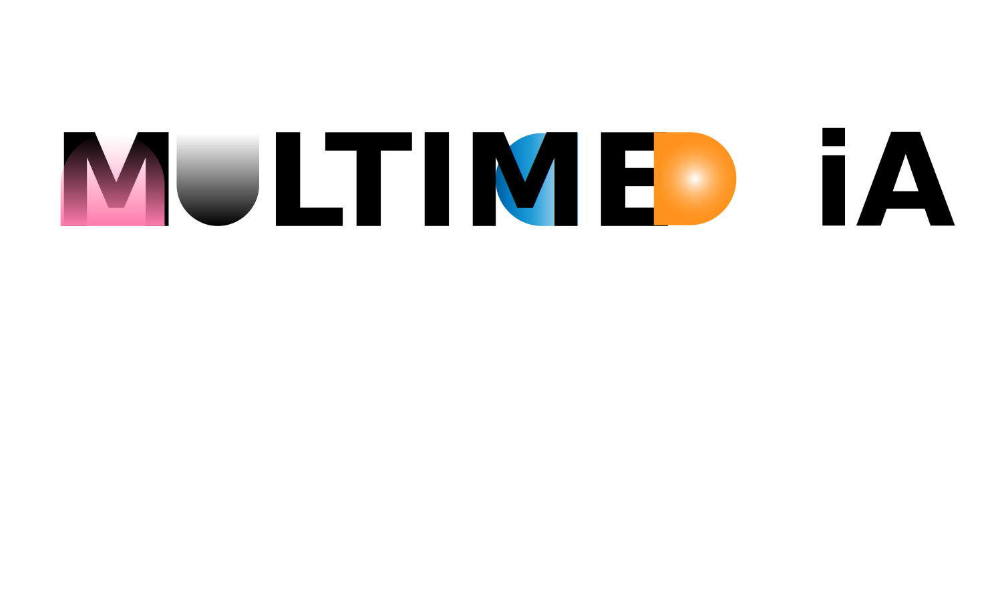

  <picture>
    <source srcset="./public/images/icon-text-white.svg" media="(prefers-color-scheme: dark)" />
    <source srcset="./public/images/icon-text.svg" media="(prefers-color-scheme: light)" />
    
  </picture>

## Sobre MULTIMEDIA

MULTIMEDIA es un blog que ofrece una plataforma para explorar y compartir contenido acerca de diseño y programación.

<em>En desarrollo... </em>
